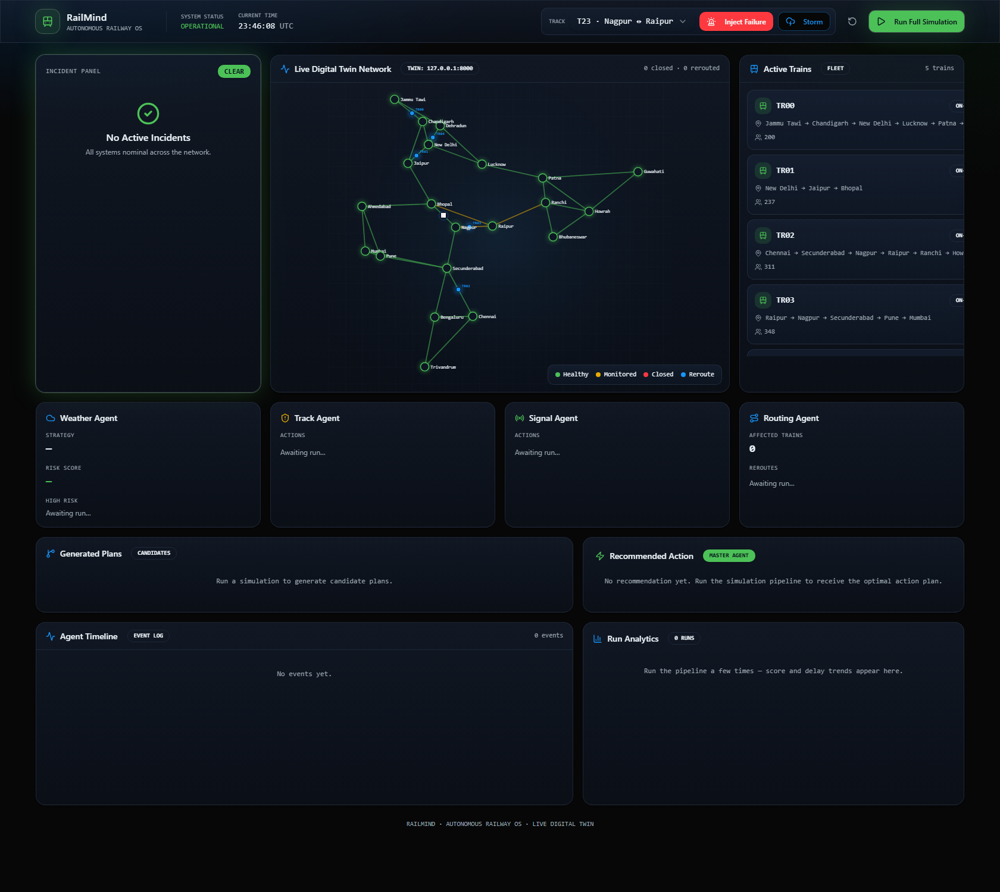
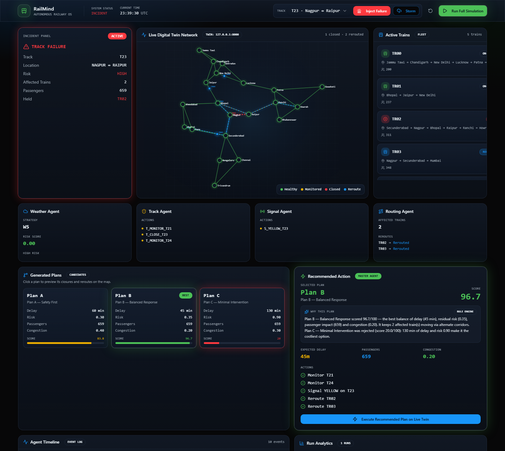

# RailMind 🚆🧠

[](https://github.com/rakshit-737/Railmind/actions/workflows/ci.yml)

**RailMind** is an autonomous multi-agent railway operating system that monitors, predicts, and optimizes railway operations in real time.

A **digital twin** of a 21-station Indian railway network feeds a **LangGraph pipeline of specialist AI agents** (weather, track, signal, routing) that generate candidate response plans, play each one against the incident snapshot with a twin-informed cost model, and rank them with **MCDM scoring** — all surfaced live on a mission-control **operator console**.

> **Zero-setup demo:** every layer is offline-first. No API keys, no internet required — the whole stack runs on your laptop.

**Live operations** — trains moving on real geography, ambient weather, per-track health:



**Incident response** — failure injected: held train flagged, reroutes drawn, three scored plans, explained recommendation, one-click execution:



---

## Architecture

```text
┌──────────────────────────┐     ┌──────────────────────────────────────┐
│  Digital Twin (Django)   │     │  Agent Orchestrator (FastAPI +       │
│  :8000                   │◄────│  LangGraph)  :8001                   │
│                          │     │                                      │
│  • 21 stations, 33       │     │  Weather → Track → Signal → Routing  │
│    corridors (real geo)  │     │      └────────────┬─────────────┘    │
│  • Trains + weather      │     │                Planner               │
│  • Clone / close-track / │     │          (Plans A / B / C)           │
│    reroute / risk APIs   │     │                   │                  │
└──────────────────────────┘     │         Simulation Engine            │
                                 │      (clone twin, score plans)       │
        shared canonical         │                   │                  │
        network dataset          │            Master Agent              │
   railmind/data/                │      (min-max MCDM ranking)          │
   india_network.json            └───────────────────┬──────────────────┘
                                                     │ REST (CORS)
                                 ┌───────────────────▼──────────────────┐
                                 │  Operator Console (React + Vite)     │
                                 │  :8080 — live map, fleet, plans,     │
                                 │  agent timeline, failure injection   │
                                 └──────────────────────────────────────┘
```

| Layer | Tech | Directory |
|---|---|---|
| Core engine (twin, graph, simulator) | Python, NetworkX, Pydantic | [`railmind/`](railmind/) |
| Digital twin API | Django + DRF (+ Swagger docs) | [`railmind_django/`](railmind_django/) |
| Agent orchestrator | FastAPI + LangGraph | [`agents/`](agents/) |
| Operator console | React 19, TanStack Start, Tailwind | [`railmind-projec/`](railmind-projec/) |

All layers share one canonical network — [`railmind/data/india_network.json`](railmind/data/india_network.json) — so station and track IDs line up end to end.

---

## Quickstart

### Option A — one command (Docker)

```bash
docker compose up
```

Twin on :8000, agents on :8001, console on http://localhost:8080. Set `ANTHROPIC_API_KEY` in your environment first if you want Claude-written plan explanations.

### Option B — local dev (three terminals)

Prerequisites: **Python 3.11+**, **Node 24+** (the lockfile is npm 11 format; CI runs Node 24).

### 1. Digital twin (Django) — port 8000

```bash
pip install -r railmind_django/requirements.txt
cd railmind_django
python manage.py runserver 8000
```

Interactive API docs: http://127.0.0.1:8000/api/docs/

### 2. Agent orchestrator (FastAPI) — port 8001

```bash
pip install -r agents/requirements.txt
cd agents
uvicorn all_agent:app --port 8001
```

Interactive API docs: http://127.0.0.1:8001/docs

The orchestrator auto-discovers its twin: `TWIN_BASE_URL` env var → local Django (`:8000`) → hosted twin → **embedded twin** (built in-process from the bundled dataset). It works even if you skip step 1.

### 3. Operator console (React) — port 8080

```bash
cd railmind-projec
npm install
npm run dev
```

Open http://localhost:8080. If the agent service is unreachable, the console falls back to a built-in mock pipeline on the same network — the UI always works.

### Core engine only (no servers)

```bash
python -m railmind.main          # twin + future simulator CLI demo
python railmind/plot_results.py  # network + scenario charts (needs matplotlib)
```

---

## Demo script (3 minutes)

1. Open the console — the twin is **alive**: trains glide along real corridors, weather rolls in and clears, congestion drifts. No clicks needed.
2. Select track **T23 · Nagpur ↔ Raipur** and click **Inject Failure** — watch:
   - agent decisions **stream into the timeline live** as the pipeline thinks,
   - the failed track turns red; any train approaching it is **HELD** (red, delay accruing),
   - three candidate plans appear, scored 0–100 — **click each one to preview** its closures and reroutes on the map,
   - the Master Agent explains its choice in plain language (Claude-written when `ANTHROPIC_API_KEY` is set).
3. Click **Execute Recommended Plan on Live Twin** — reroutes are applied to the real twin. Held trains start moving along their alternate corridors within seconds; re-running the pipeline confirms nothing is left to fix. The loop is closed.
4. Stack a cascade: inject a second failure, then click **Storm** — scenarios accumulate and the plans get harder. The **Run Analytics** panel charts score and delay across your runs.
5. The **↺** button resets the twin to baseline between demos.
6. URL shortcuts: `/?autorun` runs the pipeline on load, `/?inject=T23` injects a failure on load.

---

## How decisions are made

1. **Specialist agents** each read the twin snapshot and emit strategies:
   - *Weather* — per-track risk from live conditions (storm/rain/fog) or sensor feeds
   - *Track* — health thresholds → close / speed-restrict / monitor
   - *Signal* — combined health + weather risk → RED / YELLOW / GREEN (IRGSR-style rule table)
   - *Routing* — Dijkstra reroutes for every train crossing a failed section
2. **Planner** composes three doctrines: **A — Safety First**, **B — Balanced Response**, **C — Minimal Intervention**. Weather response scales with the doctrine: A carries emergency closures (with reroutes around them), B speed restrictions, C monitoring only — so approving "Minimal Intervention" never executes an emergency closure.
3. **Simulation engine** plays each plan against the incident snapshot with a twin-informed cost model — delay, residual risk, passenger impact and congestion, including stranded-train penalties for plans that ignore failures. (The core engine's `railmind/simulator.py` additionally forecasts scenarios by cloning the twin and ticking it forward — that clone-and-advance path backs the CLI demo.)
4. **Master Agent** min-max normalises the four criteria and ranks plans with MCDM weights (risk 0.40, delay 0.35, passengers 0.15, congestion 0.10) → one recommended action with a 0–100 suitability score.

---

## Key API endpoints

| Service | Endpoint | Purpose |
|---|---|---|
| Twin | `GET /api/state/` | Full network snapshot (tracks, trains, weather, graph) |
| Twin | `POST /api/copy/` | Clone the twin into a sandbox "future" session |
| Twin | `POST /api/track/close/` · `POST /api/route/find/` | Mutate / query the twin |
| Twin | `POST /api/weather/set/` | Set weather on a track |
| Twin | `POST /api/reset/` | Rebuild baseline twin between demos |
| Agents | `GET /state` | Live twin snapshot (the console polls this — trains move each tick) |
| Agents | `POST /run` | Run the full pipeline on the live twin |
| Agents | `GET /run-stream` | Same, streaming agent decisions over SSE (`?inject_track=`, `?weather_track=`) |
| Agents | `POST /simulate-track-failure/{track_id}` | Persistently close a track, then run the pipeline (failures stack) |
| Agents | `POST /simulate-weather/{track_id}?condition=STORM` | Persistently inject weather, then run the pipeline |
| Agents | `POST /apply-plan` | Execute a plan on the live twin (closes tracks, applies reroutes) |
| Agents | `POST /reset` | Reset the twin to baseline |

---

## Deployment

[`render.yaml`](render.yaml) is a Render blueprint for both backend services (`railmind-twin`, `railmind-agents`). After the twin deploys, set `TWIN_BASE_URL` on the agents service to its public URL. The console is an SSR app — publish it through Lovable (or any Node host) with `VITE_API_BASE_URL` pointing at the deployed agent service; locally it needs no config at all.

---

## Configuration

| Variable | Where | Default | Effect |
|---|---|---|---|
| `TWIN_BASE_URL` | agents | auto-discover | Point the orchestrator at a specific twin |
| `ANTHROPIC_API_KEY` | agents | unset | Claude-written plan explanations (rule-engine fallback otherwise) |
| `VITE_API_BASE_URL` | console | `http://127.0.0.1:8001` | Agent service URL |
| `RAILMIND_LIVE_OSM` | core | off | Load the real network from OpenStreetMap (Overpass) instead of the bundled dataset; results are cached, failures fall back offline |
| `DJANGO_SECRET_KEY` · `DJANGO_DEBUG` · `DJANGO_ALLOWED_HOSTS` | twin | dev-friendly defaults | Production hardening — `render.yaml` sets all three on deploy; local dev needs none |

---

## Tests

```bash
# Backend (fresh clone: install both service requirements first)
pip install -r railmind_django/requirements.txt -r agents/requirements.txt pytest
python -m pytest -q            # on Windows: PYTHONUTF8=1 python -m pytest -q

# Console
cd railmind-projec && npm install && npm test
```

The suite is hermetic — an exported `ANTHROPIC_API_KEY` is stripped so tests never call the real API. CI (GitHub Actions) runs the pytest suite, Django system checks, a core-engine smoke run, and the console typecheck/lint/test/build on every push. See [docs/PITCH.md](docs/PITCH.md) for the judge-facing overview.
